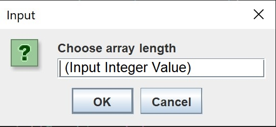
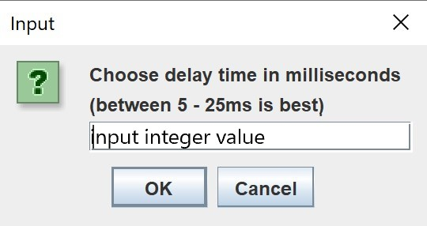
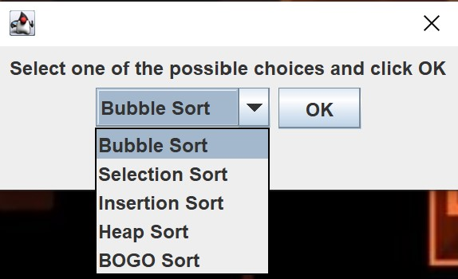
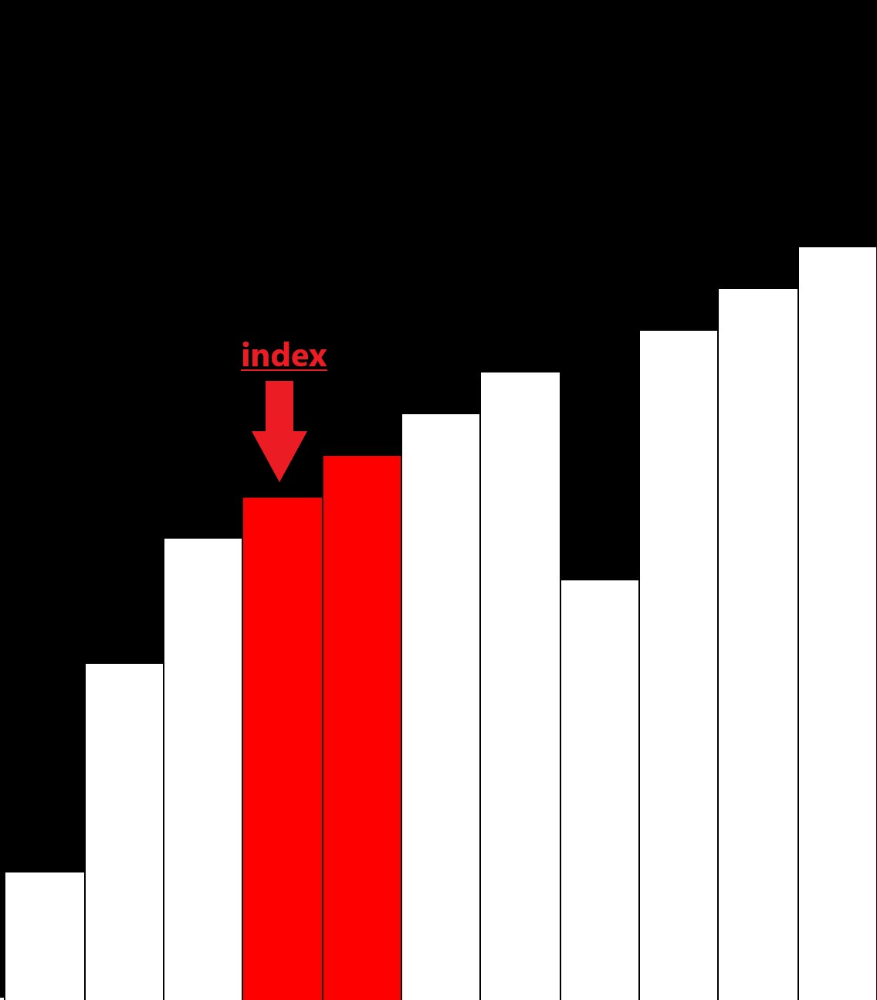
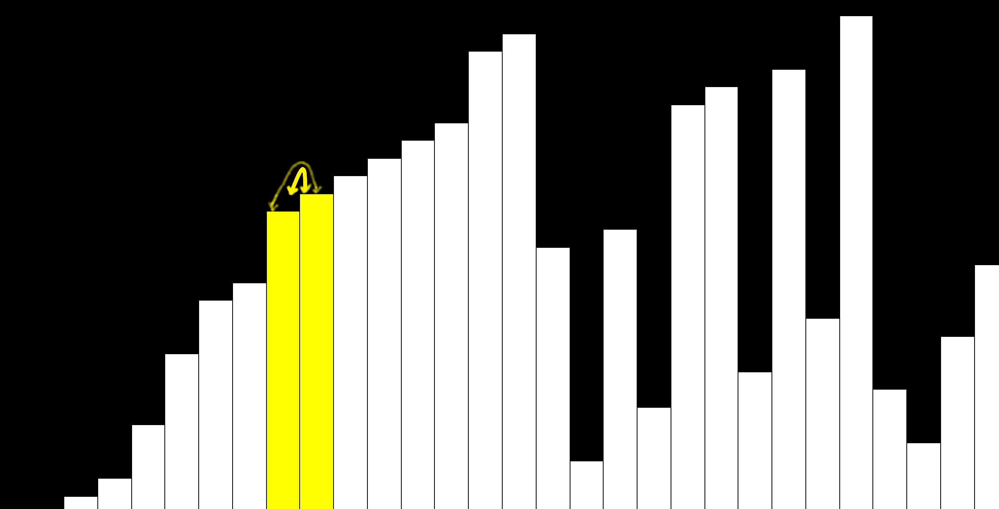
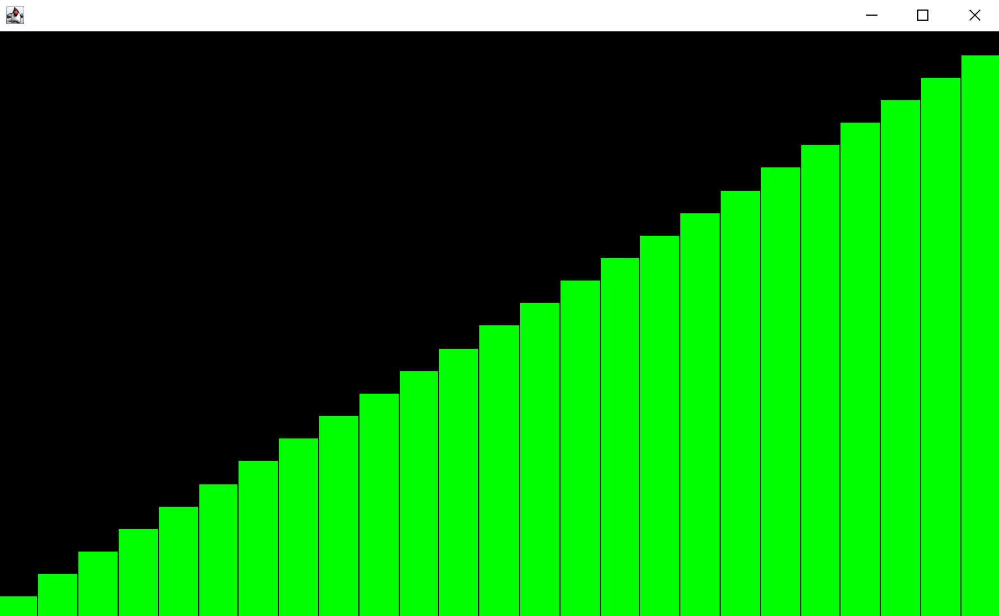

# VisualSort v.1 #

This app can help users understand how a sort works in various array sizes, with GUI elements to indicate actions made during the sorting process. It can also be used just for fun.

## How to Use ##

Upon entering the program, you will be prompted to enter an array length. This will generate an array with the specified length, but randomly ordered.

After confirming the array length, you'll also enter the delay between each action in milliseconds(ms). An action can be a swap being performed, or a comparison being made. The lower the delay time, the faster the sort will complete.

A dropdown list will popup after selecting the **time delay**. All of the sorting algorithms avaliable are in the drop down menu, and can be selected by the user. Once you've selected your choice, press "OK" and the sorting will begin. 

## Visual Indicators ##

### Graphical Interface ###

The values of the array are represented as vertical bars with a high directly correlated with the index's value. The visual indicators in the program are explained below.

A bar highlighted in **red** indicates the position of the **index pointer**  before the swap is made. The other bar highlighted in red is the other value being compared to by the _index pointer_.

>[!NOTE]
>The **Index Pointer** refers to the position in the array that is currently selected (For Example, in this array,   `[0, 2, 3, 5]`, the value `2` is in the 2nd position of the array, so the index pointer position is `1`, (array positions >start at 0) 

Once a comparison requiring a swap has been made, a _swap_ can occur, which is represented by the values turning **yellow**

Upon completing, the visualizer will highlight each value in **green**, or scan through the length of the array and progressively scan the chart green. The sort is now completed, and the program is halted. Close the window to exit.

